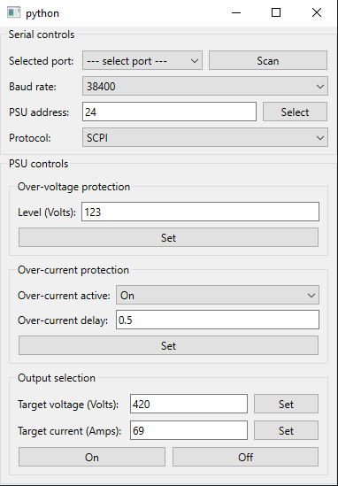

# rocketlab-hitl



# Setup

It is recommended to create a virtual environment for the project with

```
    python -m venv <name>
```

The environment can then be activated with the command

```
    source <name>/bin/activate
```

# Dependencies

The project's dependencies are listed in `requirements.txt` and can be installed with the command

```
    pip install -r requirements.txt
```


